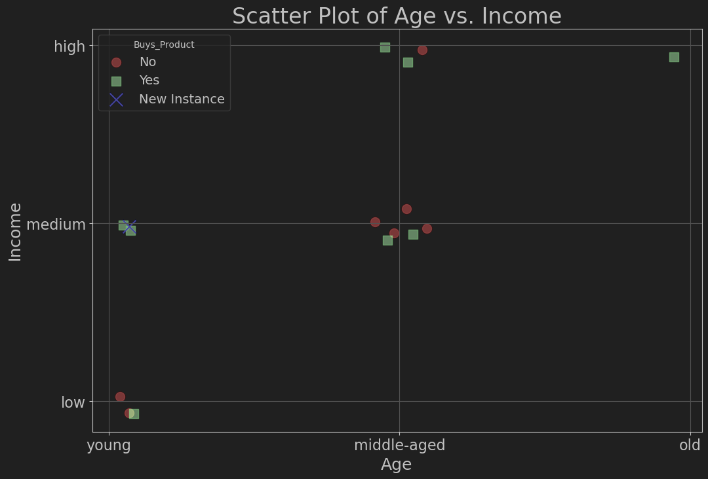

# Scatter Plot Visualization of Age vs. Income

This project visualizes a scatter plot of age and income data to understand the relationship between these factors and the likelihood of purchasing a product. The data is categorized and mapped to numerical values for visualization, and jitter is added to enhance the visual separation of the data points.

## Dataset

The dataset consists of the following columns:
- **Age**: Categorical variable with values `young`, `middle-aged`, and `old`.
- **Income**: Categorical variable with values `low`, `medium`, and `high`.
- **Buys_Product**: Binary variable indicating whether the individual buys the product (`Yes` or `No`).

A new instance is also included in the visualization to demonstrate where it would fall in the scatter plot.

## Requirements

- Python 3.x
- pandas
- matplotlib
- numpy

## Output

The script will display a scatter plot showing the relationship between age and income, with color-coded markers indicating whether the individual buys the product. A new instance will also be plotted to show its predicted position.

### Scatter Plot of Age vs. Income

The scatter plot below visualizes the data points with jitter to prevent overlap. The colors and markers represent the different categories of `Buys_Product`.

